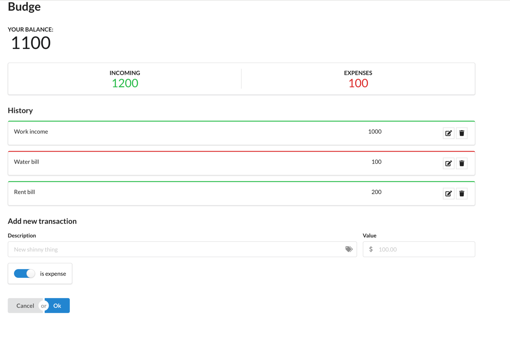

# budge

## 目的
本次demo是为了学习如何使用redux

## 技术栈
- react
- redux
- semantic-ui-react
- Saga

## 实现效果

1. 添加收入支出
    添加所有的收入支出，包括收入支出的名称，金额，是收入还是支出等，点击 OK button, 将数据添加到列表中,清空所有输入框
2. 支出收入列表
    支出收入列表，包括收入支出的名称，金额，是收入还是支出等，收入支出根据收入支出的外框来判断，收入为绿色，支出为红色
3. 支出收入总和
    收入支出总和根据收入支出的比例来计算
4. 支出收入比例
    支出收入比例，包括收入总和，支出总和，收入支出总和根据收入支出列表的金额来计算
5. 支出收入列表的修改
    支出收入列表的修改，包括收入支出的名称，金额，是收入还是支出等，点击收入支出列表右侧的 修改 button, 将数据修改到列表中
6. 支出收入列表的删除
    支出收入列表的删除，点击收入支出列表右侧的 删除 button, 将数据从列表中删除

UI图：

